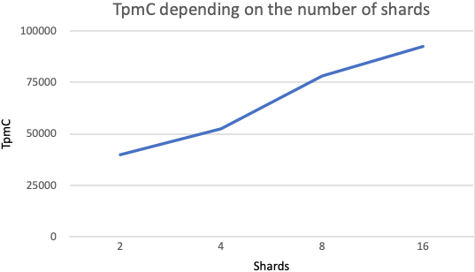

# Automatic benchmarks on Pull Request
To trigger automatic benchmark tests on a pull request, you need to put label `performance` on your PR. Github workflow will build a new docker image and push it to Yandex Cloud Docker registry. After that it will apply [terraform manifest](../.github/actions/benchmarks/main.tf), that will create 4 PostgreSQL shards, 1 VM with new SPQR image and load 1 VM. All resources are in Yandex Cloud and accessable only by Yandex team. Benchmarks are started by cloud-init after load VM is created.

You can monitor and see the results by the link, sent by github action bot into your PR.

In our tests we use a [fork of benchbase](https://github.com/dvkashapov/benchbase-spqr), specified for SPQR. Config can be seen [here](../.github/actions/benchmarks/benchbase.xml.tpl).

Each shard runs on s3-c8-m32 (8 vCPU, 100% vCPU rate, 32 GB RAM) with 300 GB of disk size. Max connections parameter is set to 1600. Benchmark user has connection limit of 1500. 

Router runs on VM with 32 vCPU, 100% vCPU rate and 32 GB RAM. Router config can be seen [here](../.github/actions/benchmarks/router.yaml)

# SPQR benchmarks

TPC-C (Transaction Processing Performance Council - C) benchmark is a standardized performance test used to measure the performance of database systems under conditions of high load and a large number of transactions. It simulates the operation of an online store with a large number of simultaneous users, each of whom performs various operations with goods, such as viewing, adding to the cart, buying, etc.

There are a lot of implementations of TPC-C test, in our experiments we use [Percona TPC-C Variant](https://github.com/Percona-Lab/sysbench-tpcc).

We ran PostgreSQL on s3.medium (8 vCPU, 100% vCPU rate, 32 GB RAM) instances and 300 GB of memory with default Managed PostgreSQL Cluster settings. In each test we were increasing shard count only.

### Results

| Warehouses | Shards    | CPU | TPS  | TpmC  | TpmC per CPU |
| ---------- | --------- | --- | ---- | ----- | ------------ |
| 1000       | no router | 8   | 433  | 26010 | 3251.25      |
| 1000       | 2         | 16  | 664  | 39840 | 2490         |
| 1000       | 4         | 32  | 875  | 52500 | 1640.625     |
| 1000       | 8         | 64  | 1303 | 78180 | 1221.5625    |
| 1000       | 16        | 128 | 1543 | 92580 | 723.28125    |

As you can see, one router scales workload decently up to 8 shards.

However, at some point adding more routers is necessary. But still there's a big room for improvement of router performance.

You can compare this results with [Vitess and Aurora](https://www.amazon.science/publications/amazon-aurora-on-avoiding-distributed-consensus-for-i-os-commits-and-membership-changes), Performance Results.