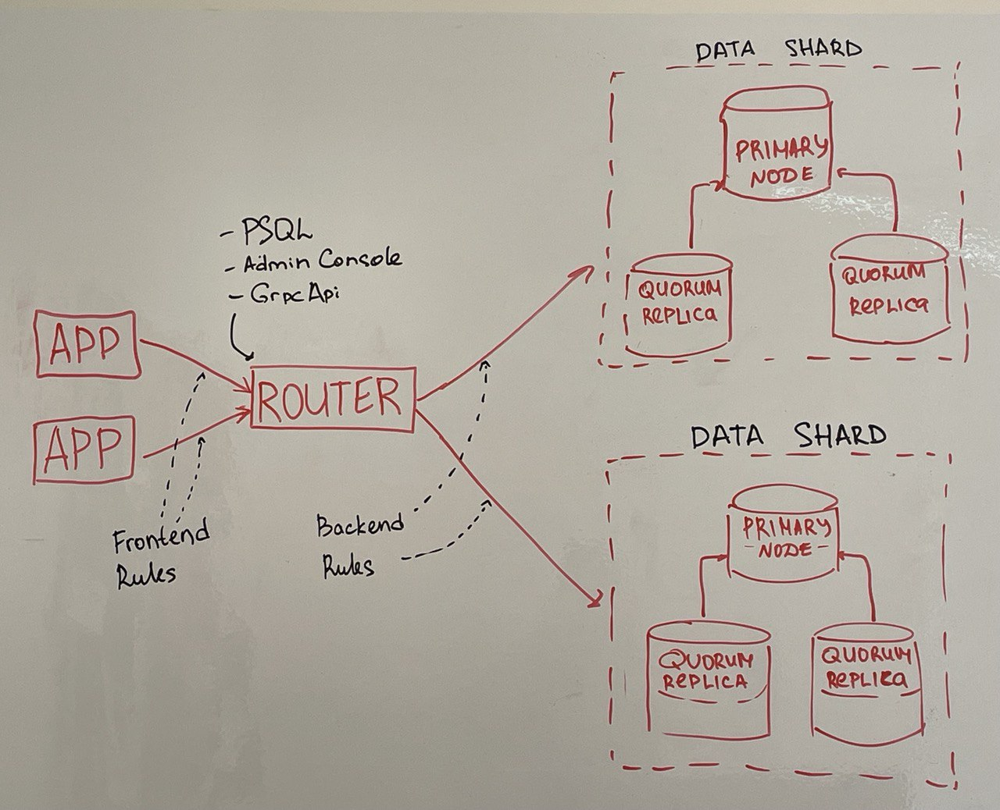

# Router

Consist of 3 parts:
- Router - an app that works by PostgreSQL protocol. It receives a SQL query, parses it, and decides to which shard it should be sent. Then returns the query response.
- Admin Console - an app that works by PostgreSQL protocol. There you can manage sharding, see [Syntax.md](./Syntax.md).
- GRPC API - an app that works by GRPC protocol. It is also used to manage sharding.

## Query Path

The path of the query depends on:

- Backend Rules settings: connections from a user app to the router.
- Frontend Rules settings: connections from the router to each shard.
- Sharding columns and key ranges added via Admin Console.

## Configuration

All SPQR configurations can be written in json, yaml or toml format. See examples in [examples](../examples/) or [pkg/config/router.go](../pkg/config/router.go)

### general settings

| **Name**               | **Description**                                                                                                                                                                               |
| ---------------------- | --------------------------------------------------------------------------------------------------------------------------------------------------------------------------------------------- |
| `log_level`            | can be `fatal`, `error`, `warning`, `info`, `debug` and `disabled``                                                                                                                           |
|                        |                                                                                                                                                                                               |
| `host`                 | the router and its apps will be run on this host                                                                                                                                              |
| `router_port`          | the router port                                                                                                                                                                               |
| `admin_console_port`   | the admin console port                                                                                                                                                                        |
| `grpc_api_port`        | the API port                                                                                                                                                                                  |
|                        |                                                                                                                                                                                               |
| `init_sql`             | a path to a SQL command, that will be run on the router's startup. It will be ignored if memqdb_backup_path exists.                                                                           |
| `router_mode`          | mode in which router will be run. Can be LOCAL and PROXY. In local mode spqr works like an usual connection pooler with one shard, in proxy mode works with many shards.                      |
| `jaeger_url`           | a path to the Jaeger instance - open source software for tracing transactions between distributed services                                                                                    |
| `world_shard_fallback` | can be true or false. If false, then router will raise an error when query will be impossible to send to particular shard. If true, then router will route unrouted query to the world shard. |
| `show_notice_messages` | can be true or false. May help to debug the router and see to where it is actualy sending queries                                                                                             |
| `time_quantiles`       | list of time quantiles to show querry time statistics. When empty, no statistics is collected                                                                                                 |
| `memqdb_backup_path`   | MemQDB backup state path. MemQDB's state restored if a file backup exists during the router startup. If there is no file, init.sql will be used.                                              |

### frontend_tls

Client's TLS config, see [tls config description](#tls-config-description) section

### frontend_rules

| **Name**                  | **Description**                                                     |
| ------------------------- | ------------------------------------------------------------------- |
| `db`                      | the database to connect to                                          |
| `usr`                     | the username with to connect                                        |
| `auth_rule`               | authentication method, see [Authentication.md](./Authentication.md) |
|                           |                                                                     |
| `pool_mode`               | the pooling mode to use. Can be `SESSION` or `TRANSACTION`          |
| `pool_prepared_statement` | use prepared statements or not. Can be false or true                |
| `pool_default`            | use this rule by default. Can be true or false                      |

### backend_rules

| **Name**        | **Description**                                                                          |
| --------------- | ---------------------------------------------------------------------------------------- |
| `db`            | the database to connect to                                                               |
| `usr`           | the username with to connect                                                             |
|                 |                                                                                          |
| `pool_discard`  | execute `DISCARD ALL` and reset client parameters before using the server from the pool. |
| `pool_rollback` | execute `ROLLBACK` if server left in active transaction. Close connection otherwise.     |
| `pool_default`  | use this rule by default. Can be true or false                                           |
| `auth_rule`     | default authentication method for all shards                                             |
| `auth_rules`    | map of different authentication methods for different shards                             |

### shards

| **Name** | **Description**                                                                    |
| -------- | ---------------------------------------------------------------------------------- |
| `db`     | the database to connect to                                                         |
| `usr`    | the username with to connect                                                       |
| `pwd`    | the username's password                                                            |
| `hosts`  | list of data shard hosts in `host:port` format                                     |
| `type`   | can be `DATA` or `WORLD`, see World                                                |
| `tls`    | server's TLS config, see [TLS config description](#tls-config-description) section |

### tls config description

| **Name**    | **Description**                                                                                                                                                                                                                                                  |
| ----------- | ---------------------------------------------------------------------------------------------------------------------------------------------------------------------------------------------------------------------------------------------------------------- |
| `sslmode`   | supported modes:   -"disable"     - disable TLS protocol -"allow"       - switch to TLS protocol on request -"require"     - TLS clients only -"verify_ca"   - require valid client certificate -"verify_full" - require valid client ceritifcate |
| `cert_file` | certificate file                                                                                                                                                                                                                                                 |
| `key_file`  | private key file                                                                                                                                                                                                                                                 |
