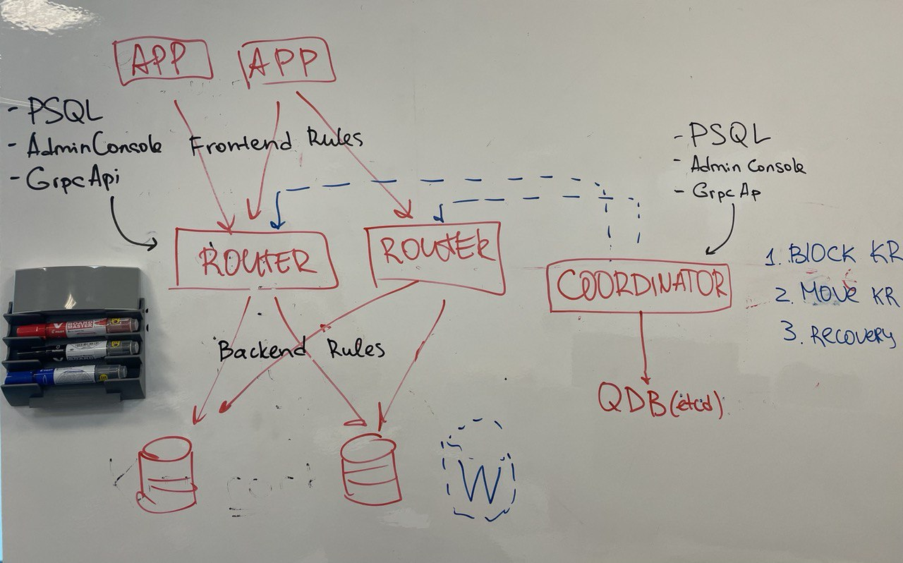

# SQPR Concepts



## Data shard
```
┌────────────────────────────────────────────────────────┐
│                         Data Shard                     │
│                                                        │
│                                                        │
│                  ┌───────────────┐                     │
│                  │               │                     │
│             ┌───▶│ Primary Node  │◀────┐               │
│             │    │               │     │               │
│             │    └───────────────┘     │               │
│             │                          │               │
│             │                          │               │
│     ┌───────────────┐          ┌───────────────┐       │
│     │               │          │               │       │
│     │Quorum replica │          │Quorum replica │       │
│     │               │          │               │       │
│     └───────────────┘          └───────────────┘       │
│                                                        │
│                                                        │
└────────────────────────────────────────────────────────┘
```
## Router

## Coordinator
