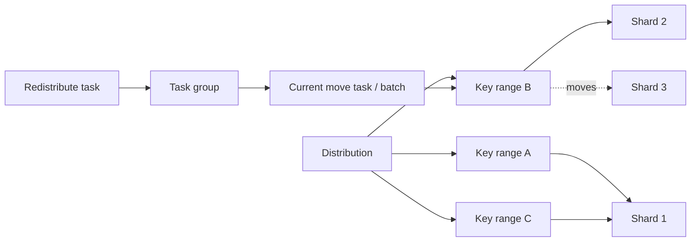
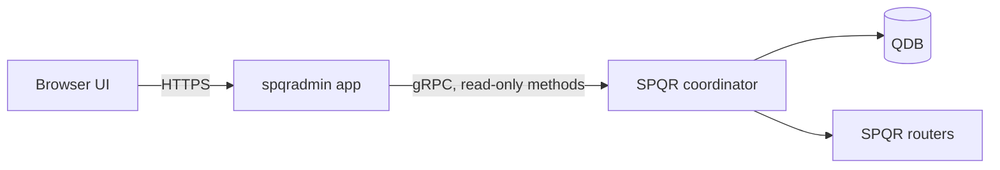

# SPQR Admin: key-range topology and data-movement visualization

| Field | Value |
| --- | --- |
| Status | Exploration — visual concept decision pending |
| Related issue | [pg-sharding/spqr#2021](https://github.com/pg-sharding/spqr/issues/2021) |
| Screens and behavior | [Required screens and behavior](2021-spqradmin-screens.md) |
| Visual concepts | [Atlas, Transfer Desk, and Control Map](2021-spqradmin-visual-concepts.md) |
| Audience | SPQR maintainers, contributors, operators, and technical writers |
| Last updated | 2026-08-26 |

## Summary

`spqradmin` is a read-only web interface over SPQR administrative data. It connects two views that currently require several `SHOW` commands and internal state:

1. an ordered map of distributions, key ranges, and shards;
2. an activity view for data moves, showing source, destination, phase, lock state, last error, and the available evidence about physical data location.

This is not a general PostgreSQL monitoring dashboard. Its purpose is to explain SPQR's routing topology and data-movement state machine accurately enough for onboarding, incident diagnosis, documentation, and presentations.

The evaluated layouts and comparison are maintained in [Visual concepts](2021-spqradmin-visual-concepts.md). The recommended target is **C — Control Map**, delivered first as an Atlas-style map with a read-only activity rail. Deeper transfer diagnostics follow when the necessary durable state is exposed. Screen-independent requirements live in [Required screens and behavior](2021-spqradmin-screens.md).

## Problem, users, and goals

SPQR's core model is spatial: a distribution divides an ordered key space into ranges, and each range routes to a shard. Console rows expose the facts but not adjacency, ownership, or how a split, unite, or redistribution changes the map. This makes the initial mental model harder to acquire than it needs to be.

A redistribution is also not atomic. A task group creates batched move tasks that may split a range, copy and delete rows, update coordinator and router metadata, unite ranges, and unlock the result. Operators currently correlate task, key-range, and journal state with logs and, when necessary, `spqr-monitor verify`. After a failure, the UI must answer:

1. What is moving, from where, and to where?
2. Which phase failed?
3. Is the range locked, and are application queries affected?
4. Where does routing metadata point?
5. What is durably recorded about row placement, and what remains unverified?
6. What is safe to do next?

The same map should produce deterministic, presentation-quality screenshots without browser chrome, operational controls, secret addresses, or unrelated monitoring widgets.

| User | Job to be done | Required outcome |
| --- | --- | --- |
| New adopter or contributor | Understand distributions, adjacent ranges, and shard ownership without first learning every console command | Can explain why a key routes to a shard |
| Operator performing redistribution | Follow source, destination, affected interval, current phase, completed work, and lock impact | Can decide whether to wait or investigate |
| Operator recovering from failure | Separate known, inferred, and unknown facts about placement | Does not make a destructive decision from an ambiguous status |
| Maintainer or speaker | Capture a selected distribution or move for docs and slides | Gets a clean, stable view without manual redaction |

The feature must:

- connect topology, active moves, and failures in one navigable model;
- distinguish routing metadata, transfer journals, and physical verification;
- remain useful from a small demo to 10,000 key ranges;
- preserve exact raw values and familiar `SHOW`-shaped tables for experts;
- start read-only and fit the current admin-console model.

Out of scope for the first release:

- CPU, disk, WAL, replication lag, failover, backups, and replica management;
- replacing Prometheus/Grafana, shard monitoring, or log aggregation;
- a graphical SQL editor or unrestricted SQL input;
- executing `STOP`, `RETRY`, `SPLIT`, `UNITE`, or `REDISTRIBUTE`;
- claiming byte, row, or percentage progress that SPQR did not measure;
- proportional key-space width for types without meaningful numeric coverage.

## Domain and observability model



UI terminology must match the console. Plain-language explanations may supplement these terms, not replace them.

| SPQR term | UI meaning |
| --- | --- |
| Distribution | Routing namespace and sharding-key definition |
| Key range | Ordered interval of a distribution's key space |
| Shard | Logical destination to which a key range routes |
| Redistribute task | User request to move a key range |
| Task group | Durable unit coordinating batched moves |
| Move task | Current batch-level split/move/unite operation |
| Transfer transaction | Durable physical copy/delete phase for one range |
| Locked key range | Range temporarily unavailable to application queries |

### Existing read surface

The table below records what operators can inspect today through the admin console. `spqradmin` will obtain the same domain data from the coordinator's gRPC services rather than issuing PostgreSQL-wire `SHOW` commands. Missing fields therefore become additive gRPC contract work.

| Source | Useful fields | UI use | Limitation |
| --- | --- | --- | --- |
| `SHOW shards` / `SHOW hosts` | Shard IDs, hosts, health-related data | Inventory and labels | Host details may be sensitive |
| `SHOW distributions` / `SHOW relations` | Distribution and relation metadata | Selector and detail | No map-friendly summary |
| `SHOW key_ranges` | ID, shard, distribution, lower bound, lock | Basic topology | Upper bound derives from the next range |
| `SHOW key_ranges_extended` | Lower/next bound, coverage, lock | Ordered intervals | Coverage is unsuitable for varchar and incomplete for composite keys |
| `SHOW task_groups` | Range IDs, destination, batch size, current task, state, message, timestamps | Activity and last error | Source shard, issuer, `total_keys`, and successful history are absent |
| `SHOW move_tasks` | Group, temporary range, bound, `PLANNED/SPLIT/MOVED` | Batch timeline | Completed batches are normally deleted |
| `SHOW task_groups_ext` | Planned bounds and `USED` | Batch-count estimate | Not row or byte progress |
| `SHOW redistribute_tasks` | Range, destination, batch size | Requested move | Stored state is not exposed |
| `SHOW move_stats` | Average router, shard, QDB, and total time | Advanced diagnostics | Aggregate process statistics, not per-task progress |
| `spqr-monitor verify` | Source/destination row counts per relation | Physical verification | Potentially expensive and not a `SHOW` query |

The existing gRPC contract already closes some `SHOW` gaps: `MoveTaskGroup` includes issuer, `totalKeys`, `boundRel`, and `limit`, while `RedistributeTask` includes its stored state. The remaining MVP gaps are the two move journals and status timestamps.

See [`pkg/engine/virtual_relation.go`](../../pkg/engine/virtual_relation.go) and [`docs/sharding/manual_rebalancing.mdx`](../sharding/manual_rebalancing.mdx).

Two existing QDB journals are essential for failure diagnosis but are not exposed by `SHOW`:

- key-range move: `PLANNED → AWAITED → LOCKED → DATA_MOVED → COORD_META_UPDATED → COMPLETE`;
- physical transfer: `planned → locked → data_copied`, followed by source deletion and journal removal.

### Exact state vocabulary

A key range has no `HEALTHY` state. Raw states from different objects must remain separate.

| Object | States | Presentation rule |
| --- | --- | --- |
| Key range in QDB | `LOCKED`, `UNLOCKED` | Current `SHOW` surfaces this as a lock boolean |
| Key range in gRPC | `LOCKED`, `AVAILABLE` | `AVAILABLE` is the API spelling of unlocked; do not mix spellings for one source |
| Key-range move journal | `PLANNED`, `AWAITED`, `LOCKED`, `DATA_MOVED`, `COORD_META_UPDATED`, `COMPLETE` | Show the raw state and a separate user-facing phase |
| Physical transfer journal | `planned`, `locked`, `data_copied` | Preserve lower-case raw values; the record disappears after source deletion |
| Move task | `PLANNED`, `SPLIT`, `MOVED` | Describes the current batch, not the entire redistribution |
| Task group | `PLANNED`, `RUNNING`, `ERROR` | `ERROR` carries the operator-facing message; successful groups are removed |
| Redistribute task over gRPC | `RedistributeTaskPlanned`, `RedistributeTaskMoved` | Already exposed by `ListRedistributeTasks`; retain the raw value in details |

No active record means only that no durable move or transfer record is present. `UNLOCKED`/`AVAILABLE` describes availability, not balance, host reachability, or verified placement.

### Truth layers

The UI must never collapse these layers into one “data is on shard X” label.

| Layer | Question | Source of truth |
| --- | --- | --- |
| Routing metadata | Where will the coordinator route this range? | `SHOW key_ranges[_extended]` |
| Router convergence | Have routers received the mapping? | Move phase; later, explicit router acknowledgement if added |
| Transfer journal | Which copy/delete step completed durably? | QDB move and transfer journals |
| Physical verification | How many matching rows are on each shard? | Explicit diagnostic such as `spqr-monitor verify` |

Facts in the interface are labeled **Known** when backed by durable metadata or completed verification, **Inferred** when derived from range order or a journal transition, and **Unknown** when another diagnostic is required.

## Competitive research

Research used public documentation and source available on 2026-08-26.

| Product | Relevant behavior | Lesson for SPQR |
| --- | --- | --- |
| Vitess / VTAdmin | Centralized web client and HTTP/gRPC API spanning multiple clusters. Workflow lists include type, source/target keyspaces and shards, stream counts by state, update time, and actions. Detail pages add configurable refresh, stream/detail/VDiff/raw-data tabs, traffic state, lag, row/byte copy progress, messages, and recent logs. States include `Copying`, `Running`, `Stopped`, `Error`, and `Throttled`; topology remains a separate graph/tree. Read-only mode and RBAC are supported. | Borrow list/detail navigation, explicit source/target, state marker plus text, refresh feedback, failure context, raw data, and read-only deployment. Improve by linking movement directly to the ordered range instead of requiring a topology/workflow mental join. |
| Citus / Azure shard rebalancer | `citus_rebalance_start()` creates a background job. `citus_rebalance_status()` returns structured phase, phase index/count, last change, and moved/total shards per colocation group. `get_rebalance_progress()` reports each move's table, shard ID and size, source/target and sizes, and coarse state. `get_rebalance_table_shards_plan` previews work. Azure aggregates moved-in/out counts by node and affected shard count, data size, and state by table, and says whether rebalancing is recommended. | Borrow honest `current / total` units, high-level phases, two aggregation levels, and future plan preview. Avoid primary details hidden in JSON, table-only refresh, or percentages from incomparable units. |
| Postgres Pro Shardman | CLI/SQL/JSON/HTTP surfaces. `shardmanctl status` supports table/JSON output, filtering, sorting, and warning/error/fatal severity; `shardmanctl cluster topology` returns table/JSON/text. Rebalance moves partitions from the fullest to emptiest replication group until their count differs by at most one; colocated partitions move together through logical replication. Commands cover cluster, table, and individual-partition moves. Failed runs have an explicit cleanup workflow, and `shardmand` exposes `/tables` for partition-to-shard mapping. No dedicated public rebalance UI was found. | Keep a stable machine-readable boundary and make recovery explicit. Differentiate with a public visualization joining task, range lock, transfer phase, and verification. |

Vitess is the strongest UI reference; Citus provides the clearest progress contract; Shardman reinforces the value of machine-readable topology and recovery workflows. None makes SPQR's ordered key range the central object.

Sources: [VTAdmin concept](https://vitess.io/docs/24.0/concepts/vtadmin/), [VTAdmin introduction](https://vitess.io/blog/2022-12-05-vtadmin-intro/), [VTAdmin workflow source](https://github.com/vitessio/vitess/tree/main/web/vtadmin/src/components/routes/workflow), [Citus rebalancer functions](https://docs.citusdata.com/en/stable/develop/api_udf.html), [Azure shard rebalancer](https://learn.microsoft.com/en-us/azure/cosmos-db/postgresql/howto-scale-rebalance), [Shardman rebalancing](https://postgrespro.ru/docs/shardman/current/rebalancing-the-data), [shardmanctl](https://postgrespro.ru/docs/shardman/current/shardmanctl-ref), [shardmand API](https://postgrespro.ru/docs/shardman/current/shardmand).

## Design principles

- **Show facts, not decoration.** Every map segment represents a real key range and opens its exact bounds, distribution, shard, and lock state.
- **State certainty explicitly.** Placement is labeled Known, Inferred, or Unknown and points to the evidence behind that claim.
- **Keep geometry honest.** Proportional width is used only for a known numeric domain; other keys use equal-width ordered ranges, while measured data volume remains a separate encoding.
- **Separate ownership from status.** Shard fill shows ownership; text plus an outline, stripe, icon, or overlay shows `LOCKED`, movement, failure, or uncertainty.
- **Lead with an overview, preserve raw evidence.** The first view answers “what is where?” and one action reveals the exact coordinator values behind it.
- **Start read-only and make views reproducible.** MVP copies but does not execute recovery commands, and its cluster, distribution, range, task, viewport, and presentation state are linkable.

Blue marks selection or movement; green is reserved for an existing terminal success state such as `MOVED` or `COMPLETE`; amber marks `LOCKED`/attention; red marks failure; gray marks unknown or unavailable. Shard colors stay lower-emphasis and never encode task state.

## SPQR visual language

`spqradmin` should look like an operational part of SPQR. The live [project site](https://pg-sharding.tech/), [documentation](https://docs.pg-sharding.tech/welcome), and [`docs/mint.json`](../mint.json) establish the following foundation:

- light-first white and near-white surfaces with cool gray borders;
- `Inter` with system fallbacks; application text at `14–16px` with `20–24px` line height, and identifiers/raw states in compact monospace;
- restrained radii: `8px` for controls, `12–16px` for major contained surfaces;
- subtle shadows only for elevation;
- compact documentation-like navigation and information density;
- the existing SPQR mark and wordmark, with no second logo, neon operations palette, or default dark NOC treatment.

A faint blue radial wash from the marketing site may appear in presentation mode or an empty state, never behind dense range data.

| Role | Token | Use |
| --- | --- | --- |
| Primary | `#5382ff` | Docs-aligned links, focus, selection, and primary action |
| Primary tint | `#e2ebff` | Selected rows, navigation, low-emphasis overlays |
| Marketing blue | `#3b82f6` | Optional presentation accent; do not mix with primary within a component |
| Text | `#191a1e` | Headings and primary copy |
| Muted text | `#727377` | Secondary labels and timestamps |
| Border | `#f0f1f5` | Dividers and contained surfaces |
| Canvas | `#ffffff` / `#f5f6fa` | Main and secondary surfaces |
| Lock | Amber plus stripe/icon | `LOCKED` |
| Error | Red plus icon/label | Task group `ERROR` or inconsistent journals |

Shard ownership uses a stable color-blind-aware palette with short labels. If shard count exceeds the palette, color may repeat only with a distinct label or hatch. Product blue stays reserved for selection and movement.

## Scale model: hundreds first

Hundreds of ranges are normal; thousands are supported. Fully labeled cards across an unbounded horizontal scroll are not a viable primary view.

The map has three coordinated layers:

1. **Distribution overview:** a fixed-height minimap of the full order. At one or more pixels per range, one mark equals one range. At higher density, pixels bin adjacent ranges and disclose count and shard mix. Locks, selection, active moves, failures, and inconsistencies remain individual overlay markers.
2. **Readable viewport:** a movable window, typically 20–60 exact ranges on desktop, labeled `Ranges 181–220 of 842`.
3. **Exact index:** virtualized search/jump by ID, bound, shard, or ordinal position, synchronized with the map and accessible raw table.

| Range count at current width | Initial representation | Exact navigation |
| --- | --- | --- |
| A few to roughly 32 | All ranges labeled | Selection and arrow keys |
| Roughly 33–250 | Full minimap plus labeled viewport | Minimap window, paging, search/jump |
| Above roughly 250 | Binned overview plus virtualized viewport | Search/jump, minimap window, exact index |

Thresholds derive from available pixels and minimum readable width, not protocol constants. At 10,000 ranges, the DOM and accessibility tree contain only the visible window and focused details; the overview uses canvas or another bounded surface. Interaction cost is proportional to visible ranges plus overview bins.

Aggregation preserves ordinal order and applies only to the overview. Every bin reports `n ranges` and shard mix; any bin can lead to an exact range in one action. Stable URLs retain the selected range or ordinal window. Acceptance cases are 1, 12, 240, 1,842, and 10,000 ranges, with locks and failures at the first, middle, and last positions.

Detailed interface requirements are maintained in [Required screens and behavior](2021-spqradmin-screens.md). Alternative layouts and the recommendation are maintained in [Visual concepts](2021-spqradmin-visual-concepts.md).

## User-facing transfer phases

The UI presents a stable phase model while retaining raw states in details.

| UI phase | Internal evidence | Routing interpretation | Physical interpretation |
| --- | --- | --- | --- |
| Prepare | Group `PLANNED`, move `PLANNED/AWAITED` | Source | Source |
| Lock | Move `LOCKED`, transfer `planned/locked` | Source; range locked | Source; copy may be active |
| Copy | Transfer `locked` | Source; range locked | Source plus unconfirmed target copy |
| Delete source | Transfer `data_copied` | Source; range locked | Target copy recorded; source may still contain rows |
| Update coordinator | Move `DATA_MOVED` | Source until update completes | Target; journal says source deletion completed |
| Update routers | Move `COORD_META_UPDATED` | Coordinator points to target; routers converging | Target |
| Unlock | Move `COMPLETE` before cleanup | Target; briefly may remain locked | Target |
| Done | Move/task records removed | Target | Target according to completed journal, not independent verification |

An inconsistent combination is labeled `Attention: inconsistent transfer metadata`, not forced into a normal phase.

## gRPC contract and application architecture

`spqradmin` connects to the coordinator through its existing gRPC API. It does not query the PostgreSQL-compatible admin console.

### P0: existing services

| UI data | Coordinator gRPC methods |
| --- | --- |
| Key ranges and locks | `KeyRangeService.ListAllKeyRanges`, `ListKeyRange`, `ListKeyRangeLocks` |
| Distributions and relations | `DistributionService.ListDistributions`, `GetDistribution` |
| Shards and routers | `ShardService.ListShards`, `RouterService.ListRouters` |
| Move tasks and groups | `MoveTasksService.ListMoveTasks`, `ListMoveTaskGroups`, `GetAllMoveTaskGroupStatuses`, `GetMoveTaskGroupBoundsCache` |
| Redistribution | `RedistributeTaskService.ListRedistributeTasks` |

The app uses only read methods even though these services also expose mutation. `SHOW move_stats` is not required for the first release; it needs a read RPC before it can appear in advanced diagnostics.

### P0: additive read contract

Expose the two existing QDB journals through read-only gRPC methods, with final service and message names to be decided:

```proto
rpc ListKeyRangeMoves(google.protobuf.Empty) returns (ListKeyRangeMovesReply);
// move_id, key_range_id, destination_shard_id, state

rpc ListTransferTransactions(google.protobuf.Empty) returns (ListTransferTransactionsReply);
// key_range_id, source_shard_id, destination_shard_id, state
```

Add `updated_at` to task-group status replies so the UI can distinguish active from stale work. Existing gRPC messages already expose task-group issuer, `totalKeys`, `boundRel`, and `limit`, plus redistribute-task state. These additions read existing coordinator/QDB data and require no new shard queries.

### P1: history and diagnostics

- Retain bounded successful and failed task history with terminal state, timestamps, endpoints, moved batches/keys, and final message.
- Add an explicit rate-limited verification RPC with per-relation source/destination counts, timestamp, duration, and completeness.
- Never run expensive count queries automatically on refresh.

### Application shape



Start with a standalone process or sidecar near the coordinator. It uses generated SPQR protobuf clients, serves the browser application, remains stateless except for optional bounded snapshots/history, and sits behind the operator's existing ingress and authentication. No PostgreSQL-wire adapter or SQL parser is required.

The app calls only allowlisted read-only RPCs and adds `observed_at`, coordinator identity/version, and per-source errors to its browser-facing responses. One failed RPC makes only its dependent panels stale/unknown. Active tasks may refresh every 2–5 seconds while topology refreshes less often; overlapping refreshes are canceled and all RPCs have strict deadlines. Presentation mode changes client rendering, not authorization.

## Security and privacy

- Keep the MVP read-only and never expose coordinator gRPC credentials in browser code or URLs.
- Treat coordinator responses and error messages as sensitive; presentation mode hides hostnames, ports, database names, and raw errors by default.
- Give `spqradmin` a viewer identity restricted to read RPCs. The coordinator services also contain mutations, so UI-level hiding is not an authorization boundary.
- Any future mutation needs separate authorization, audit log, confirmation, and server-side idempotency.

Accessibility and responsive requirements are defined with the other interface behavior in [Required screens and behavior](2021-spqradmin-screens.md#accessibility-and-responsive-behavior).

## Delivery and acceptance

| Milestone | Scope | Acceptance signal |
| --- | --- | --- |
| 1 — Explain the cluster | App with read-only gRPC client, selector, ordered map, range/shard/lock detail, raw data, presentation mode, linkable selection | A new user maps a key to a shard in under one minute and captures a clean topology screenshot |
| 2 — Explain active work | Activity rail from existing gRPC services, range/task cross-highlight, honest batch progress, last error, lock impact | Operator identifies range, source, destination, and current task without `psql` |
| 3 — Explain failures safely | Move and transfer journals, phase timeline, truth layers, recovery links/commands, optional verification | Injected failures at every durable phase produce the same routing and placement facts as QDB/recovery tools |
| 4 — History and controlled actions | Bounded history, before/after topology, optional plan preview; stop/retry/verify only after separate safety design | Actions, if added, meet authorization, audit, confirmation, and idempotency requirements |

Across milestones:

- every active or failed task reconciles with its underlying gRPC/QDB state;
- 10,000 ranges remain usable through a binned minimap, virtualized exact viewport, and direct jump;
- presentation capture needs no manual infrastructure redaction;
- no unrequested shard-wide count query runs.

## Open decisions

The first decision is the [visual direction](2021-spqradmin-visual-concepts.md): Atlas for the smallest learning/presentation release, Transfer Desk if recovery dominates, or the recommended phased Control Map. The next design pass must settle:

- production desktop and responsive layouts;
- exact grouping/zoom behavior from 100 to 10,000 ranges;
- wording for each injected failure-state combination;
- presentation-only capture versus direct SVG/PNG export;
- service placement and message schemas for the proposed journal RPCs;
- whether bounded history belongs in QDB or `spqradmin`.

## References

### SPQR

- [Issue #2021 — spqradmin](https://github.com/pg-sharding/spqr/issues/2021)
- [SPQR project site](https://pg-sharding.tech/)
- [SPQR documentation](https://docs.pg-sharding.tech/welcome)
- [Documentation theme configuration](../mint.json)
- [Coordinator gRPC registration](../../coordinator/app/app.go)
- [Key-range gRPC service](../../protos/key_range.proto)
- [Task gRPC services](../../protos/tasks.proto)
- [Distribution gRPC service](../../protos/distribution.proto)
- [Admin console `SHOW` documentation](../snippets/show.mdx)
- [Manual shard rebalancing](../sharding/manual_rebalancing.mdx)
- [Virtual relations](../../pkg/engine/virtual_relation.go)
- [Task model](../../pkg/models/tasks/tasks.go)
- [Key-range move state machine](../../coordinator/pkg/clustered_coord.go)
- [Physical transfer state machine](../../pkg/datatransfers/data_transfers.go)
- [Recovery monitor](../../cmd/monitor/main.go)

### Competitors

- [Vitess VTAdmin](https://vitess.io/docs/24.0/concepts/vtadmin/)
- [Introducing VTAdmin](https://vitess.io/blog/2022-12-05-vtadmin-intro/)
- [VTAdmin workflow UI source](https://github.com/vitessio/vitess/tree/main/web/vtadmin/src/components/routes/workflow)
- [VTAdmin workflow list source](https://github.com/vitessio/vitess/blob/main/web/vtadmin/src/components/routes/Workflows.tsx)
- [VTAdmin workflow detail source](https://github.com/vitessio/vitess/blob/main/web/vtadmin/src/components/routes/workflow/WorkflowDetails.tsx)
- [Vitess workflow state enum](https://github.com/vitessio/vitess/blob/main/proto/binlogdata.proto)
- [Citus utility functions and rebalance status](https://docs.citusdata.com/en/stable/develop/api_udf.html)
- [Azure portal shard-rebalancer UX](https://learn.microsoft.com/en-us/azure/cosmos-db/postgresql/howto-scale-rebalance)
- [Postgres Pro Shardman rebalancing](https://postgrespro.ru/docs/shardman/current/rebalancing-the-data)
- [Postgres Pro Shardman CLI reference](https://postgrespro.ru/docs/shardman/current/shardmanctl-ref)
- [Postgres Pro Shardman daemon/API](https://postgrespro.ru/docs/shardman/current/shardmand)
